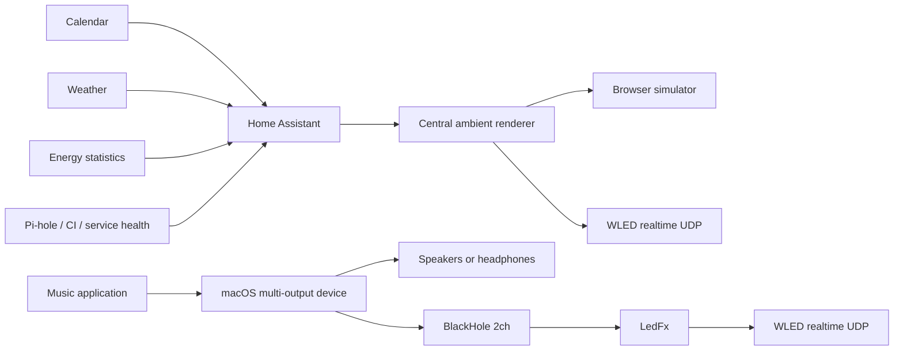

# Ambient WLED Display

Turn a WLED installation into a calm, glanceable information display without
giving up its primary job as a beautiful light.

This project combines:

- WLED presets and its JSON API
- Home Assistant semantic automations
- A central configurable-FPS layered renderer and browser simulator
- LedFx and BlackHole for music-reactive lighting on macOS
- Optional energy, weather, presence, calendar, network, and CI signals

The central idea is to treat position, color, motion, and time as a compact
visual language. For example, the included hourly display performs a sweep,
turns the strip completely dark, then tolls the hour by adding one illuminated
dot per second near the physical top of a vertical strip. It holds the completed
count for five seconds, fades back to its ambient base, and releases WLED to its
existing preset when running under temporary ownership.

The renderer models multiple WLED devices and physical lanes centrally. It
combines ambient color, persistent context, and prioritized events into complete
pixel frames, then sends those frames through WLED's realtime UDP interface.

## Features

- Top-down 12-hour cumulative bell-toll display
- Stateful animated rain with clinging beads, fast heavy drops, merging rivulets, and evaporating trails
- Adaptive living nebula shaped by time, weather, temperature, and wind
- Named emotional states with quiet, balanced, and expressive personalities
- Wind-responsive color currents and sparse organic glimmers between major events
- Manual palettes and motion controls when you want a specific look
- Welcome, comfort, curiosity, goodbye, reminder, success, warning, storm, and celebration signals
- Explicit multi-output lane configuration and synchronized rendering
- Browser control center with an exact physical-lane simulator
- Stable configurable UDP realtime output instead of HTTP animation choreography
- Independent sender and WLED receiver FPS, jitter, and deadline monitoring
- Persistent semantic layers and prioritized temporary events
- Multi-device configuration for future rooms and stairs
- Explicit music mode so LedFx and the renderer never fight for ownership
- WLED preset fallback when the renderer or network is unavailable
- Weather, presence, workday, Pi-hole, energy, and GitHub Actions examples
- WLED preset provisioning through the JSON API
- LedFx launcher and scene selector that finds BlackHole by name
- No custom WLED firmware required

## Architecture



See [the architecture guide](docs/architecture.md), [control-center guide](docs/control-center.md),
[deployment and operations](docs/deployment.md), [performance audit](docs/performance-audit.md),
[visual language](docs/visual-language.md), and [living-house roadmap](docs/living-house-roadmap.md).

## Quick start

### 1. Prepare WLED

WLED must be reachable from the machine running Home Assistant.

```bash
cp .env.example .env
```

Edit `.env`, then provision the reusable presets:

```bash
set -a
source .env
set +a
./wled/install-presets.sh
```

The installer intentionally contains no Wi-Fi credentials and communicates
only with the configured WLED JSON endpoint.

### 2. Start the renderer in safe preview mode

Copy the example configuration and set each device host, pixel count, lane,
and physical orientation:

```bash
cp renderer/config.example.json renderer-config.json
docker compose -f renderer/compose.example.yaml up -d --build
```

Keep `output_enabled` set to `false` at first. Open
`http://raspberrypi.local:8090`, run test events in the exact lane simulator,
and select **Renderer → WLED** only when the preview is correct. Set
`output_enabled` to `true` after physical verification if the renderer should
resume automatically after a restart.

### 3. Connect Home Assistant

Start with [homeassistant/examples/ambient_renderer.yaml](homeassistant/examples/ambient_renderer.yaml).
It sends semantic events and persistent context to the renderer; it does not
attempt to animate individual WLED frames.

The older files below remain available as a fallback and migration reference,
but the hourly animation should be owned by the central renderer:

Copy these files into `/config/ambient_wled/`:

```text
homeassistant/wled_client.py
homeassistant/wled_hour_marker.py
homeassistant/wled_temporary_preset.py
homeassistant/energy_usage_stats.py
```

Copy and customize the examples in `homeassistant/examples/`. Add the example
secrets to your private `secrets.yaml`; never commit that file.

The legacy hourly controller can also be tested directly:

```bash
python3 homeassistant/wled_hour_marker.py \
  --wled-url http://wled.local \
  --hour 17 \
  --dry-run
```

### 4. Configure music-reactive lighting on macOS

Install BlackHole 2ch and LedFx, then create a macOS Multi-Output Device that
contains both the listening device and BlackHole. Make the listening device
primary and enable drift correction for BlackHole.

Configure the environment and start LedFx:

```bash
set -a
source .env
set +a
./ledfx/ledfx-control.sh start
./ledfx/ledfx-control.sh energy
```

AirPlay devices such as HomePod may not remain attached to a macOS
Multi-Output Device. Bluetooth, built-in, USB, and wired outputs are generally
better suited to this routing method.

## Visual conventions

The examples follow a small vocabulary:

| Encoding | Meaning |
| --- | --- |
| Top of a vertical strip | Now, nearest, or highest priority |
| Growth downward | Increasing count or quantity |
| Upward motion | Arrival, beginning, or recovery |
| Downward motion | Departure, ending, or depletion |
| Blue | Weather, water, or cold |
| Cyan | Neutral information |
| Green | Healthy, complete, or below target |
| Amber | Upcoming or needs attention |
| Red | Failure or urgent action |
| Purple | Personal or calendar information |

Neutral information such as the hour inherits the active palette. Color
changes are reserved for cases where color itself carries information.

## Configuration

All machine-specific values are supplied through command-line options,
environment variables, or Home Assistant secrets. Important variables are
documented in [.env.example](.env.example).

Renderer-specific device layout and output settings live in the untracked
`renderer-config.json`; [renderer/config.example.json](renderer/config.example.json)
documents every currently supported field.

Everyday ambient palette, cloud, saturation, speed, and brightness choices are
made in the control center and persisted separately from deployment settings.
Adaptive mode is the normal default: Home Assistant sends house context while
the renderer turns that context into a continuously evolving mood. Manual mode
holds a chosen look until adaptive mode is selected again.

The default values are examples only:

- `WLED_URL`: WLED base URL
- `WLED_LED_COUNT`: total pixels used by preset provisioning
- `WLED_TOP_AT_HIGH_INDEX`: whether the physical top is the highest LED index
- `LEDFX_URL`: LedFx API URL
- `LEDFX_APP`: optional exact path to the LedFx macOS application
- `LEDFX_VIRTUAL_ID`: LedFx virtual device ID
- `HA_DB_PATH`: Home Assistant SQLite database path
- `HA_ENERGY_STATISTIC_ID`: energy statistic to summarize
- `HA_TIMEZONE`: IANA timezone used for daily totals

## Testing

The project uses only the Python standard library at runtime.

```bash
python3 -m unittest discover -s tests -v
bash -n ledfx/ledfx-control.sh
bash -n wled/install-presets.sh
```

GitHub Actions additionally parses all example YAML files.

## Publishing safely

Do not commit any of the following:

- `.env` or `secrets.yaml`
- Home Assistant `.storage` files or databases
- WLED configuration backups
- SSH helpers, keys, or passwords
- LedFx runtime configuration and logs
- Real webhook IDs or complete webhook URLs

## License

MIT. See [LICENSE](LICENSE).
