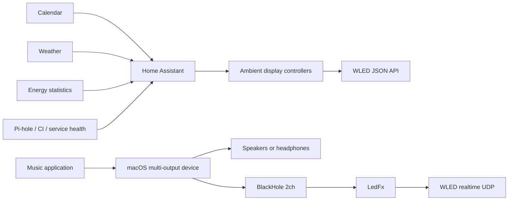

# Ambient WLED Display

Turn a WLED installation into a calm, glanceable information display without
giving up its primary job as a beautiful light.

This project combines:

- WLED presets and its JSON API
- Home Assistant automations and shell commands
- A state-preserving hourly display controller
- LedFx and BlackHole for music-reactive lighting on macOS
- Optional energy, weather, presence, calendar, network, and CI signals

The central idea is to treat position, color, motion, and time as a compact
visual language. For example, the included hourly display performs a sweep,
turns the strip completely dark, then tolls the hour by adding one illuminated
dot per second near the physical top of a vertical strip. It holds the completed
count for five seconds and fades back to the exact prior WLED state.

When one controller drives multiple physical LED outputs, the hourly display
discovers those output boundaries from WLED and mirrors the sweep and tolls on
each strip independently.

## Features

- Top-down 12-hour cumulative bell-toll display
- Automatic multi-output strip discovery and synchronized rendering
- Current-palette preservation during neutral information displays
- Automatic pause while WLED realtime input such as LedFx is active
- Reusable temporary-preset controller with full state restoration
- Weather, presence, workday, Pi-hole, energy, and GitHub Actions examples
- WLED preset provisioning through the JSON API
- LedFx launcher and scene selector that finds BlackHole by name
- No custom WLED firmware required

## Architecture



See [the architecture guide](docs/architecture.md) and
[visual language](docs/visual-language.md) for the design principles.

## Quick start

### 1. Prepare WLED

WLED must be reachable from the machine running Home Assistant.

```bash
cp .env.example .env
```

Edit `.env`, then provision the reusable presets:

```bash
set -a
source .env
set +a
./wled/install-presets.sh
```

The installer intentionally contains no Wi-Fi credentials and communicates
only with the configured WLED JSON endpoint.

### 2. Install the Home Assistant controllers

Copy these files into `/config/ambient_wled/`:

```text
homeassistant/wled_client.py
homeassistant/wled_hour_marker.py
homeassistant/wled_temporary_preset.py
homeassistant/energy_usage_stats.py
```

Copy and customize the examples in `homeassistant/examples/`. Add the example
secrets to your private `secrets.yaml`; never commit that file.

The hourly controller can also be tested directly:

```bash
python3 homeassistant/wled_hour_marker.py \
  --wled-url http://wled.local \
  --hour 17 \
  --dry-run
```

### 3. Configure music-reactive lighting on macOS

Install BlackHole 2ch and LedFx, then create a macOS Multi-Output Device that
contains both the listening device and BlackHole. Make the listening device
primary and enable drift correction for BlackHole.

Configure the environment and start LedFx:

```bash
set -a
source .env
set +a
./ledfx/ledfx-control.sh start
./ledfx/ledfx-control.sh energy
```

AirPlay devices such as HomePod may not remain attached to a macOS
Multi-Output Device. Bluetooth, built-in, USB, and wired outputs are generally
better suited to this routing method.

## Visual conventions

The examples follow a small vocabulary:

| Encoding | Meaning |
| --- | --- |
| Top of a vertical strip | Now, nearest, or highest priority |
| Growth downward | Increasing count or quantity |
| Upward motion | Arrival, beginning, or recovery |
| Downward motion | Departure, ending, or depletion |
| Blue | Weather, water, or cold |
| Cyan | Neutral information |
| Green | Healthy, complete, or below target |
| Amber | Upcoming or needs attention |
| Red | Failure or urgent action |
| Purple | Personal or calendar information |

Neutral information such as the hour inherits the active palette. Color
changes are reserved for cases where color itself carries information.

## Configuration

All machine-specific values are supplied through command-line options,
environment variables, or Home Assistant secrets. Important variables are
documented in [.env.example](.env.example).

The default values are examples only:

- `WLED_URL`: WLED base URL
- `WLED_LED_COUNT`: total pixels used by preset provisioning
- `WLED_TOP_AT_HIGH_INDEX`: whether the physical top is the highest LED index
- `LEDFX_URL`: LedFx API URL
- `LEDFX_APP`: optional exact path to the LedFx macOS application
- `LEDFX_VIRTUAL_ID`: LedFx virtual device ID
- `HA_DB_PATH`: Home Assistant SQLite database path
- `HA_ENERGY_STATISTIC_ID`: energy statistic to summarize
- `HA_TIMEZONE`: IANA timezone used for daily totals

## Testing

The project uses only the Python standard library at runtime.

```bash
python3 -m unittest discover -s tests -v
bash -n ledfx/ledfx-control.sh
bash -n wled/install-presets.sh
```

GitHub Actions additionally parses all example YAML files.

## Publishing safely

Do not commit any of the following:

- `.env` or `secrets.yaml`
- Home Assistant `.storage` files or databases
- WLED configuration backups
- SSH helpers, keys, or passwords
- LedFx runtime configuration and logs
- Real webhook IDs or complete webhook URLs

## License

MIT. See [LICENSE](LICENSE).
