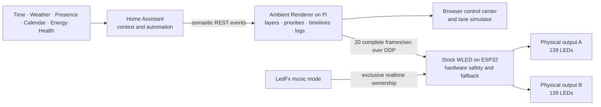

# Central Renderer Architecture

The system deliberately separates context, graphics, and hardware. Home
Assistant decides **what information matters**. The ambient renderer decides
**what every pixel should look like**. Stock WLED sends those pixels to the
physical outputs.

## Control plane and frame plane

The previous hourly controller attempted to animate through WLED's JSON control
API. That API is appropriate for occasional commands such as selecting a preset
or changing brightness. It is not a frame clock.

The renderer uses two distinct paths:

- The **control plane** carries meanings: `hour=10`, `rain=true`, or
  `mode=music`. Home Assistant sends these small REST requests to the renderer.
- The **frame plane** carries finished pictures. The renderer sends all 278 RGB
  pixels to WLED at a stable configured frame rate using DDP/UDP. The current
  office controller is deliberately set to 20 frames per second.

No animation phase depends on dozens of HTTP response times. One monotonic
clock controls the complete timeline.

## Device, lane, layer, and event

- A **device** is one WLED controller.
- A **lane** is one physical or conceptual strip within a device. The office
  controller currently has two 139-LED lanes.
- A **layer** is persistent context that modifies the baseline, such as rain or
  focus mode.
- An **event** is a bounded timeline such as the hourly clock or an urgent
  alert.

WLED segments are not used as visual layers. The renderer composites layers in
memory and sends one unambiguous final color for every pixel.

## Layer composition

The initial stack is:

1. **Ambient baseline** — a slowly rolling, configurable gradient.
2. **Rain** — a persistent blue ripple blended into the baseline.
3. **Focus** — a persistent brightness reduction.
4. **Hourly event** — an eight-second feathered wipe, cumulative bell tolls,
   five-second hold, and three-second crossfade back to the still-moving base.
5. **Urgent alert** — a higher-priority pulse that may replace a lower-priority
   event.

Adding a layer does not require changing WLED presets or segment topology. A
new layer implements a color transformation and declares its semantic meaning.

## Priority and ownership

The renderer is the sole normal frame owner. Event priorities are enforced in
one process: urgent alerts replace the hourly clock; lower-priority events wait
in a queue. Persistent layers remain part of the underlying base.

Music is an explicit exclusive mode. When mode changes to `music`, the renderer
stops sending DDP frames and cancels its temporary events. WLED's realtime
timeout releases the renderer, allowing LedFx to take ownership. Returning to
`renderer` resumes the ambient frame stream.

If the renderer container stops or the Pi becomes unavailable, DDP packets stop
and stock WLED returns to its existing preset after its configured realtime
timeout. WLED therefore remains the hardware and fallback authority.

During migration, a temporary ownership lease is available. Home Assistant can
request an event with `take_output=true`; the renderer preflights WLED, owns the
frame stream only for that event, sends a final restored frame, then releases
the controller back to its existing preset. This lets one automation migrate at
a time without making the old and new systems write pixels simultaneously.

## Hourly timeline

At the current 20 FPS, the eight-second sweep contains 160 calculated frames. A feathered
edge progressively multiplies the baseline brightness from full intensity to
black. Both lanes use their own top-to-bottom coordinate map and advance on the
same clock.

After the black frame, the event adds one dot per second. Each new dot fades in
over 180 milliseconds; earlier dots remain. Three dark pixels separate each
dot. The final count holds for five seconds. The renderer then blends every
pixel from the clock frame back into the continuously calculated baseline over
three seconds. There is no WLED segment rebuild or preset restart in that fade.

## Observability

The service exposes:

- `/health` for container health checks.
- `/api/status` for mode, measured frame rate, active phase, layers, queue,
  frame counters, last result, and errors.
- `/api/frame` for the exact simulated colors currently being sent.
- an append-only JSON Lines event log in the renderer data volume.

The browser control center uses the same API as Home Assistant. A test run is
therefore the real state machine, not a separate approximation.

## Scaling through the house

Additional WLED controllers are added as devices in `renderer.json`. Each may
have its own pixel count, brightness, output host, lanes, and orientations.
Semantic events and persistent layers accept target IDs: omit targets for the
whole house, use a device ID for one controller, or use lane IDs for individual
physical strips. Room and floor groups can be added on top of the same target
model. The compositing and priority rules remain centralized while every WLED
retains local electrical configuration and a safe fallback preset.
